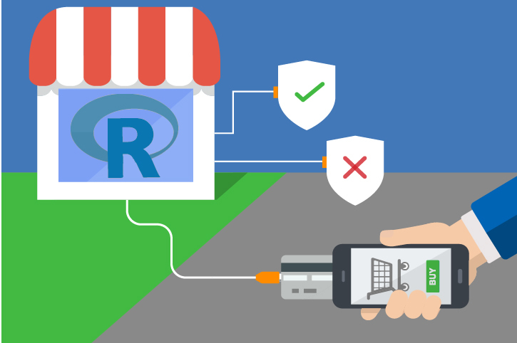

# Fraud Detection 
Predict if an online purchase transaction is fraudulent. This is an important scenario in many industries, including retail and finance.

### Deploy to Azure on SQL Server

## More samples and information
> Discover more examples at [Microsoft Machine Learning Server](https://github.com/Microsoft/ML-Server)

For all documentation, visit the [Fraud Detection website](https://microsoft.github.io/r-server-fraud-detection/).

**NOTE:** Please don't use "Download ZIP" to get this repository, as it will change the line endings in the data files. Use "git clone" to get a local copy of this repository. 

