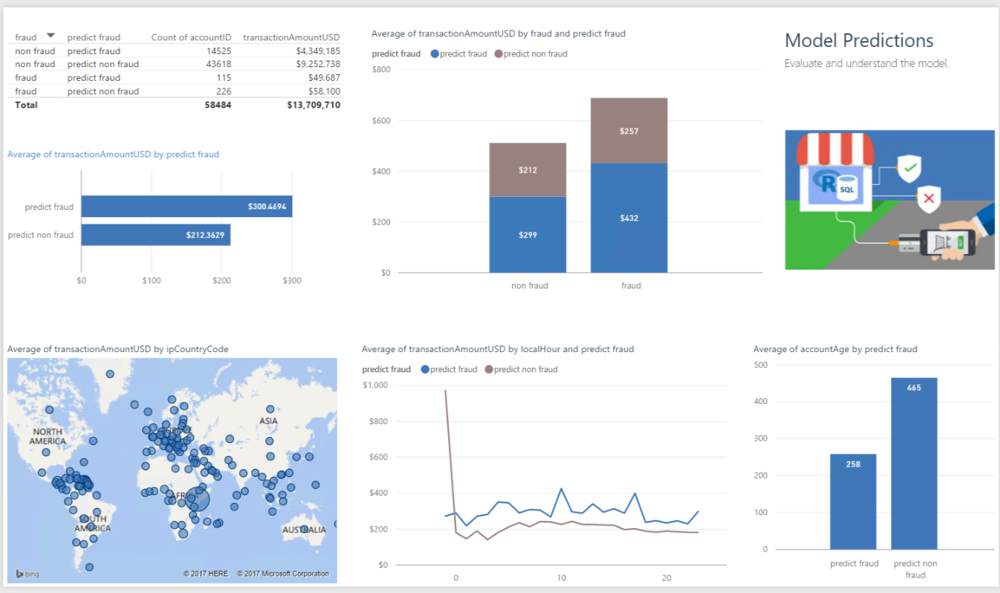

 This page describes the 
<strong>
{{ site.cig_text }}
{{ site.onp_text }}
{{ site.hdi_text }} 
</strong>
solution.


 

## For the Business Manager
------------------------------



 
SQL Server R Services takes advantage of the power of SQL Server (2016 or higher) and ScaleR (Microsoft R Server package) by allowing R to run on the same server as the database. It includes a database service that runs outside the SQL Server process and communicates securely with the R runtime. 

This solution shows how to preprocess data, create new features, train R models, and perform predictions in-database. The final table in the SQL Server database provides a predicted value for each transaction. This predicted value, which can be interpreted as a probability of fraud, can help you determine whether you wish to try to interrupt the transaction.

Microsoft R Server on HDInsight Spark clusters provides distributed and scalable machine learning capabilities for big data, leveraging the combined power of R Server and Apache Spark. This solution demonstrates how to develop machine learning models for online fraud detection (including data processing, feature engineering, training and evaluating models), deploy the models as a web service (on the edge node) and consume the web service remotely with Microsoft R Server on Azure HDInsight Spark clusters. 

Hive tables are saved containing the predicted scores during both development and production. This data is then visualized in Power BI.

The PowerBI dashboard allows you to visualize and use these predicted scores to aid in understanding the model you will deploy.

This dashboard shows the predicted scores of the data in the Test set - this is data for which we know whether the transaction was fraudulent, but was not used to build the model itself. 

Note in the top table that we predicted fraud in 14,525 cases which were not fraudulent.  This is something to keep in mind when deploying the model.  Rather than reject a transaction that is predicted to be fraud, we might instead want to add a step to the purchase that would discourage an actual fraudulent transaction while still allowing a valid transaction to occur.

 

 



To understand more about the entire end-to-end process of modeling and deploying this example, see [Typical Workflow](Typical.html).
 

[&lt; Home](index.html)
