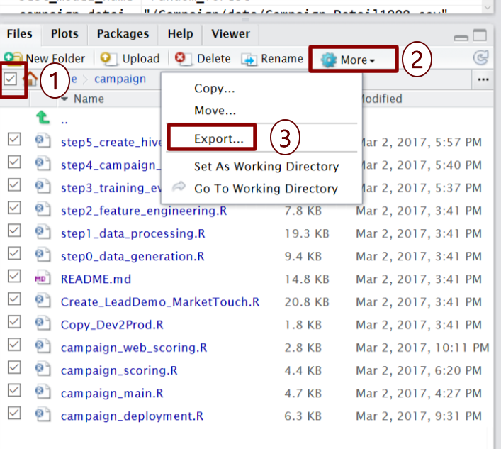

 This page describes the 
<strong>
{{ site.hdi_text }} 
</strong>
solution.

 

## HDInsight Cluster Maintenance
--------------------------------

An initial cluster was created when you used the `Deploy` button from [Cortana Intelligence Gallery]({{ site.deploy_url_hdi }}). Along with the cluster, a storage account was created.  This is where all data is stored.   

When you are finished using the entire solution, you can delete all your resources on the <a href="https://start.cortanaintelligence.com/Deployments">Cortana Intelligence Gallery Deployments</a>  page. 

If you would like to continue using the solution, you can delete the cluster while  keeping the storage account. You can then re-use the storage account later on a new cluster. 

## Deleting the Cluster

HDInsight Spark cluster billing starts once a cluster is created and stops when the cluster is deleted. Billing is pro-rated per minute, so you should always <strong>delete your cluster</strong> when it is no longer in use.

Before you delete the cluster, <a href="Typical.html#rstudiologin?path=hdi">login to RStudio</a> on the cluster edge node and save your files. 

<ol>
<li>
In the Files tab on the bottom right, check the checkbox to select all files.
</li>
<li>
Use the <code>More</code> button to find the <code>Export...</code> option.
</li>
<li>
Select <code>Export...</code> to save the files.
</li>
</ol>

Once you've saved your files you can [use these steps to delete your cluster.](https://docs.microsoft.com/en-us/azure/hdinsight/hdinsight-delete-cluster)

## Re-Using the Storage Account on a New Cluster

You can use the Azure portal to  [create a new cluster by following these steps](https://docs.microsoft.com/en-us/azure/hdinsight/hdinsight-hadoop-r-server-get-started).  Make sure you select your existing storage account instead of creating a new one, and you can pick up where you left off.

When creating your cluster, use the default names in the blades: `admin` for the cluster login, and `sshuser` for the ssh login if you want to be consistent with the original cluster created for you from the Cortana Intelligence Gallery.

Once your cluster is ready, go to RStudio and Import the files by with the <code>Upload</code> button.  Select the zip file that you exported prior to deleting the original cluster.

