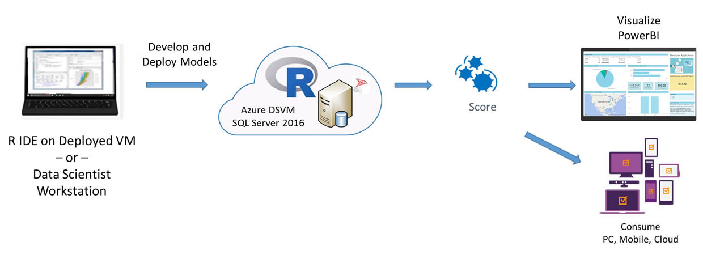
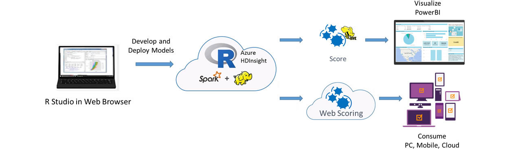

If we had a crystal ball, we would only loan money to someone if we knew they would pay us back. A lending institution can make use of predictive analytics to reduce the number of loans it offers to those borrowers most likely to default, increasing the profitablity of its loan portfolio.   This solution is based on simulated data for a small personal loan financial institution, containing the borrower's financial history as well as information about the requested loan.  It uses predictive analytics to help decide whether or not to grant a loan for each borrower.

<h2>Select the method you wish to explore:</h2>
 <form style="margin-left:30px"> 
    <label class="radio">
      <input type="radio" name="optradio" class="rb" value="cig" > {{ site.cig_text }}, deployed from <a href="{{ site.deploy_url }}">Cortana Intelligence Gallery</a>
    </label>
    <label class="radio">
      <input type="radio" name="optradio" class="rb" value="onp"> {{ site.onp_text }}
    </label>
   <label class="radio">
      <input type="radio" name="optradio" class="rb" value="hdi"> {{ site.hdi_text }}, deployed from <a href="{{ site.deploy_url_hdi }}">Cortana Intelligence Gallery</a>
    </label> 
</form>

On the VM created for you from the <a href="{{ site.deploy_url }}">Cortana Intelligence Gallery</a>, the SQL Server 2016 database <code>{{ site.folder_name }}</code> contains all the data and results of the end-to-end modeling process.  

For customers who prefer an on-premise solution, the implementation with SQL Server R Services is a great option that takes advantage of the powerful combination of SQL Server and the R language.  A Windows PowerShell script to invoke the SQL scripts that execute the end-to-end modeling process is provided for convenience. 

This solution shows how to pre-process data (cleaning and feature engineering), train prediction models, and perform scoring on the  HDInsight Spark cluster with Microsoft R Server deployed from the <a href="{{ site.deploy_url_hdi }}">Cortana Intelligence Gallery</a>.

<strong>HDInsight Spark cluster billing starts once a cluster is created and stops when the cluster is deleted. See <a href="hdinsight.html"> these instructions for important information</a> about deleting a cluster and re-using your files on a new cluster.</strong>

 

