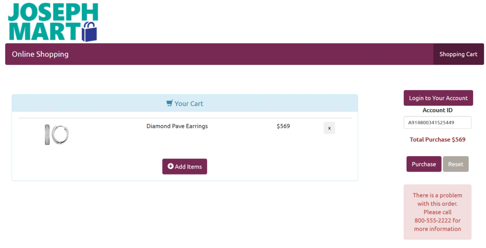

<div class="alert alert-success" role="alert"> This page describes the 
<strong>
<span class="cig">{{ site.cig_text }}</span>
<span class="onp">{{ site.onp_text }}</span>
<span class="hdi">{{ site.hdi_text }}</span> 
</strong>
solution.
</div> 

## For the Web Developer
------------------------------
<div class="row">
    <div class="col-md-6">
        <div class="toc">
          <li><a href="#starting">Starting the Website</a></li>
          <li><a href="#scoring">Scoring a Transaction</a></li>
          <li><a href="#example">Example Transaction</a></li>
          <li><a href="#remoteaccess">Remote Access to Website</a></li>

        </div>
    </div>
    <div class="col-md-6">

    The example site is built with <a href="https://nodejs.org/en/">node.js</a>.  It uses <a href="http://tediousjs.github.io/tedious/">tedius</a> for communication with SQL Server.  

    </div>
</div>



<a id="starting" />

<h2>Starting the Website</h2>
<hr/>
To start the website, type the following commands into  a terminal window or powershell window.  Substitute your own values for <span class="onp">the path and </span> username/password:

```
    cd C:\Solutions\Fraud\Website
    node server.js YOUR_SQL_USERNAME YOUR_SQL_PASSWORD
```

You should see the following response:

```
    Example app listening on port 3000!
    DB Connection Success
```

Now leave this window open and open the url [http://localhost:3000](http://localhost:3000) in your browser.  

<span class="cig">Or see below for <a href="#remoteaccess">accessing the website from a different computer</a>
</span>

<a id="scoring" />
<h2>Scoring a Transaction</h2>
<hr/>

A connection to the `Fraud` database is set up in  **server.js**.  The user name and password are supplied on the command line when starting the web server.

```javascript
var con = new Connection({ 
	userName: user,
    password: pw,
    server: 'localhost',
    // When you connect to Azure SQL Database, you need encrypt: true
     options: {  encrypt: true, database: 'Fraud' }
});
```

The `predict` function then calls the `ScoreOneTrans` stored procedure with the transaction details and receives back a predicted probability for that transaction.

```javascript
app.get('/predict', function (req, res) {
    var request = new Request('ScoreOneTrans', function(err, rowCount) {
    if (err) {
        console.log(err);
        }  
       // console.log("Rows Returned: " + rowCount )      
    });
    
    var record = req.query.record;
    console.log (record)
    request.on('row', function(col) {
          if (col[0].value === null) {
            console.log('NULL');
          } else {
            // values to return - the predicted probability
            value = col[0].value;   
          }

         res.json({ pred: value });
         request.on('doneInProc', function(rowCount, more) { 
            console.log(rowCount + ' rows returned'); 
      }); 
        
    });  
    // pass the entire record to the stored procedure
    request.addParameter('inputstring', TYPES.VarChar, record);
    con.callProcedure(request); 
    con.close; 
});
```

Finally, the function in  **public/js/scoreClaim.js** uses this probabiity to display a message to the user based on the value:

```javascript
//first get the rest of the data for this id
    record = lookupData(id, amt)
    // call /predict to get res.prob, the probability of returning the shipment
    $.ajax({
    url: '/predict',
    type: 'GET',
    data: { record: record },
    contentType:"application/json; charset=utf-8",
    error: function(xhr, error){
        console.log(xhr); console.log(error);
    }, 
    success: function(res) { 
       console.log("AccountID: " + id  + " transactionAmt: " + amt )
       console.log("Predicted probability: " + res.pred )
            // now use the probability to display one of two message 
            if (res.pred > 0.5) {  //problem with this order; 
                $("#resultArea").html('There is a problem with this order.  Please call 800-555-2222 for more information');
                        $("#resultArea").removeClass('alert-success');
                        $("#resultArea").addClass('alert-danger');
                    } else { // no problem with the order
                $("#resultArea").html('Thank you for submitting your order. You will receive an email with tracking information shortly.');
                        $("#resultArea").removeClass('alert-danger');
                        $("#resultArea").addClass('alert-success');
                    }
```


<a id="example" />
<h2> Example Transaction</h2>
<hr/>

This site is set up to mimic a sale on a website.  "Log in" by selecting an account and then add some items to your shopping cart.  Finally, hit the `Purchase` button to trigger the model scoring.  If the model returns a low probability for the transaction, it is not likely to be fraudulent, and the purchase will be accepted. However, if the model returns a high probability, you will see a message that explains the purchaser must contact a support representative to continue. 



You can view the model values by opening the Console window on your browser.

* For Edge or Internet Explorer: Press `F12` to open Developer Tools, then click on the Console tab.
* For FireFox or Chome: Press `Ctrl-Shift-i` to open Developer Tools, then click on the Console tab.


Use the `Log In` button on the site to switch to a different account and try the same transaction again.  (Hint: the account number that begins with a "9" is most likely to have a high probability of fraud.)


<div class="cig" id="remoteaccess">
<h2> Remote Access to Website</h2>
<hr/>

If you wish to access this website from another computer, perform the following steps;

<li>  Open the firewall for port 3000:
<div class="highlighter-rouge"><pre class="highlight"><code> 
     netsh advfirewall firewall add rule name="website" dir=in action=allow protocol=tcp localport=3000 
</code></pre></div>
</li>
<li>  Then start the web server:
<div class="highlighter-rouge"><pre class="highlight"><code> 
    cd C:\Solutions\Fraud\Website
    node server.js YOUR_SQL_USERNAME YOUR_SQL_PASSWORD
</code></pre></div>
</li>
<li> On other computers, use the Public IP Address in place of <code>localhost</code> in the address http://<strong>localhost</strong>:3000.  The Public IP Address  can be found in the Azure Portal under the "Network interfaces" section.
</li>
<li> Make sure to leave the terminal window in which you started the server open on your VM.
</li>
</div>